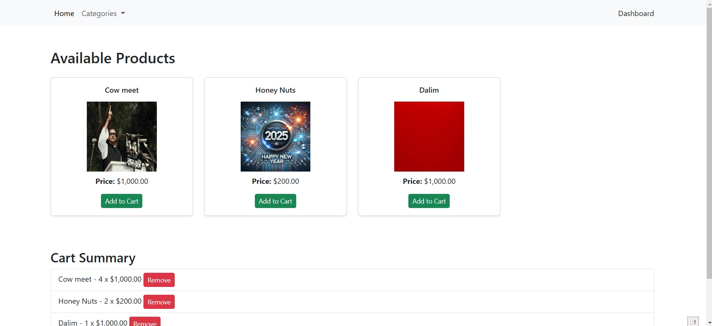
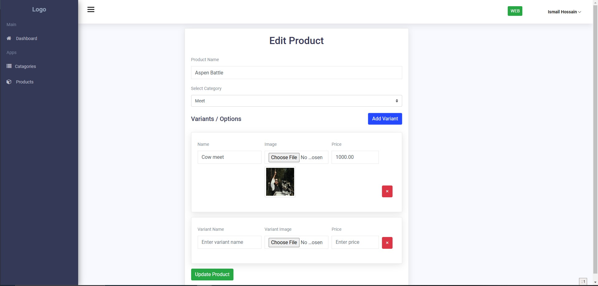
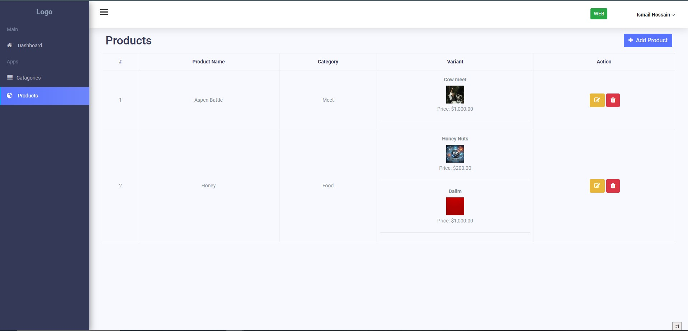

# Product Management and Cart System

This project is a simple product management system with a cart functionality, built using PHP (Laravel), MySQL, HTML, CSS, and jQuery.

## Requirements

The goal of this project is to build a form for adding products and dynamically adding/removing options to those products. The users will also be able to see the product list and add products to a cart.

### Key Features:

- **Category CRUD**: A dropdown (select) field to choose a category for the product.
- **Product CRUD**
- **Add/Remove Options**: Buttons to dynamically add or remove options/variant for the product.
- **Product List**: Display the list of products, including their category, name,and variant details.
- **Add to Cart**: Each product in the list will have a button to add it to the cart. Users can also remove products from the cart.

## Getting Started

### 1. Clone the repository:
```bash
 git clone https://github.com/ismail306/product-CRUD-with-cart_job-task.git
 cd product-CRUD-with-cart_job-task
```

### 2. Copy the example environment file and configure it:
```bash
 cp .env.example .env
```

### 3. Install dependencies:
```bash
composer update
 ```

### 4. Configure the `.env` file:
- Update database credentials to match your local setup:
 ```env
DB_DATABASE=your_database_name
DB_USERNAME=your_database_user
DB_PASSWORD=your_database_password
```
### 5. Generate Application key:
 ```bash
php artisan key:generate
 ```
---

### 2. Database Setup

#### 1.  Create tables:
 ```bash
 php artisan migrate
 ```


## Testing Instructions
### 1. Start the Laravel development server:
 ```bash
 php artisan serve
 ```
### 2. Create category before Product

### Technologies Used:

- **Backend**: PHP (Laravel)
- **Database**: MySQL
- **Frontend**: HTML, CSS, jQuery

## Some Demo 

### Home Page


### Product Create


### Show Products



